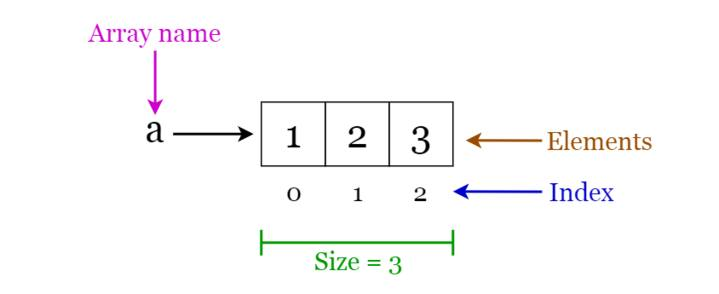

# array

# Mảng (Arrays)

Một mảng là một cấu trúc có kích thước cố định, chứa các phần tử cùng kiểu dữ liệu, có thể là số nguyên, số thực, chuỗi hoặc mảng nhiều chiều, và có thể truy cập ngẫu nhiên thông qua chỉ mục.

🔹 **Các hoạt động trên mảng**

- **Duyệt:** Đi qua các phần tử và in chúng.
- **Tìm kiếm:** Tìm kiếm một phần tử trong mảng. Bạn có thể tìm kiếm theo giá trị của phần tử hoặc chỉ mục của nó.
- **Cập nhật:** Cập nhật giá trị của một phần tử đã tồn tại tại một chỉ mục đã cho.

🔹 **Các ứng dụng của mảng**

- Được sử dụng như các khối xây dựng để tạo các cấu trúc dữ liệu khác như danh sách mảng (array lists), heap, bảng băm (hash tables), vector và ma trận.
- Được sử dụng trong các thuật toán sắp xếp khác nhau như sắp xếp chèn (insertion sort), sắp xếp nhanh (quick sort), sắp xếp nổi bọt (bubble sort) và sắp xếp trộn (merge sort).

