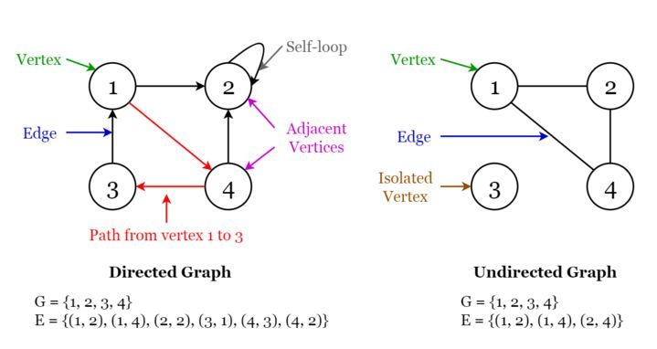

# graph

# Đồ thị (Graphs)

Một đồ thị là một cấu trúc gồm một tập hợp hữu hạn các đỉnh và tập hợp các cạnh nối các đỉnh với nhau. Bậc của một đỉnh là số cạnh kết nối với đỉnh đó. Kích thước của một đồ thị là số cạnh trong đồ thị. Hai đỉnh được cho là kề nhau nếu chúng được nối với nhau bởi cùng một cạnh. Nếu một đỉnh không kết nối với bất kỳ đỉnh nào khác trong đồ thị, nó được gọi là cô lập.

🔹 **Có hai loại đồ thị:**

- **Đồ thị có hướng:** Một đồ thị được gọi là có hướng nếu mỗi cạnh trong đồ thị có một hướng từ một đỉnh xuất phát đến một đỉnh kết thúc cụ thể.
- **Đồ thị không hướng:** Một đồ thị được gọi là không hướng nếu các cạnh trong đồ thị không có hướng cụ thể. Các đỉnh có thể được kết nối với nhau theo cả hai chiều.

🔹 **Các ứng dụng của đồ thị:**

- Được sử dụng để đại diện cho mạng xã hội. Mỗi người dùng là một đỉnh, và khi người dùng kết nối với nhau, họ tạo ra một cạnh.
- Được sử dụng để đại diện cho các trang web và liên kết bởi các công cụ tìm kiếm. Các trang web trên internet được liên kết với nhau bằng các siêu liên kết. Mỗi trang là một đỉnh và liên kết giữa hai trang là một cạnh. Được sử dụng cho Xếp hạng Trang trong Google.
- Được sử dụng để đại diện cho vị trí và tuyến đường trong GPS. Các vị trí là các đỉnh và các tuyến đường nối các vị trí là các cạnh. Được sử dụng để tính toán tuyến đường ngắn nhất giữa hai vị trí.

