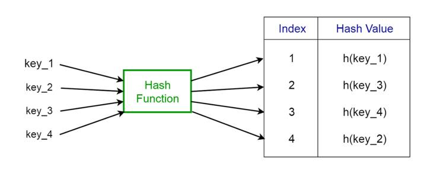

# hashtable-hash

# Bảng băm (Hash Tables)

Bảng băm là một cấu trúc dữ liệu lưu trữ các giá trị có khóa đi kèm với mỗi giá trị. Hơn nữa, nó hỗ trợ việc tra cứu một cách hiệu quả nếu bạn biết khóa đi kèm với giá trị. Do đó, nó rất hiệu quả trong việc chèn và tìm kiếm, bất kể kích thước dữ liệu.

🔹 **Các ứng dụng của bảng băm:**

- Được sử dụng để triển khai các chỉ mục cơ sở dữ liệu.
- Được sử dụng để triển khai các mảng kết hợp (associative arrays).
- Được sử dụng để triển khai cấu trúc dữ liệu “tập hợp” (set).

