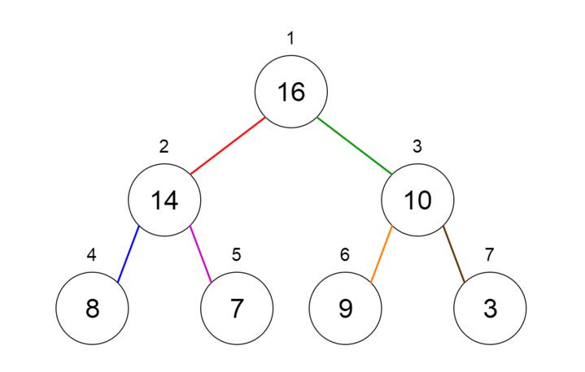

# heap

# Đống (Heaps)

Một đống là một dạng đặc biệt của cây nhị phân, trong đó các nút cha được so sánh với các nút con dựa trên giá trị và được sắp xếp theo thứ tự tương ứng. Heaps có thể được biểu diễn bằng cách sử dụng cây hoặc mảng.

🔹 **Có hai loại Heaps:**

- **Min Heap:** nút cha có khóa nhỏ hơn hoặc bằng khóa của các nút con, được gọi là thuộc tính đống nhỏ nhất. Gốc của đống chứa giá trị nhỏ nhất.
- **Max Heap:** nút cha có khóa lớn hơn hoặc bằng khóa của các nút con, được gọi là thuộc tính đống lớn nhất. Gốc của đống chứa giá trị lớn nhất.

🔹 **Các ứng dụng của Heaps:**

- Được sử dụng trong thuật toán heapsort.
- Được sử dụng để triển khai hàng đợi ưu tiên vì các giá trị ưu tiên có thể được sắp xếp theo thuộc tính đống, nơi đống có thể được triển khai bằng một mảng.
- Các chức năng hàng đợi có thể được triển khai bằng đống trong thời gian O(log n).
- Được sử dụng để tìm giá trị thứ k nhỏ nhất (hoặc lớn nhất) trong một mảng cho trước.

