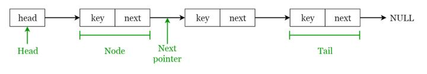

# linked-list

## Danh sách liên kết (Linked Lists)

Danh sách liên kết là một cấu trúc tuần tự gồm các nút được liên kết với nhau, không thể truy cập ngẫu nhiên. Mỗi nút chứa một khóa và một con trỏ tới nút kế tiếp, và danh sách liên kết cung cấp một biểu diễn linh hoạt cho các tập hợp động, với head trỏ tới nút đầu tiên và tail trỏ tới nút cuối cùng.

🔹 **Các hoạt động trên Linked Lists:**

- **Tìm kiếm (Search):** Tìm phần tử đầu tiên có khóa k trong danh sách liên kết đã cho bằng phương pháp tìm kiếm tuyến tính đơn giản và trả về một con trỏ tới phần tử này.
- **Chèn (Insert):** Chèn một khóa vào danh sách liên kết. Việc chèn có thể được thực hiện theo 3 cách khác nhau: chèn vào đầu danh sách, chèn vào cuối danh sách và chèn vào giữa danh sách.
- **Xóa (Delete):** Xóa một phần tử x khỏi danh sách liên kết đã cho. Bạn không thể xóa một nút bằng một bước đơn lẻ. Việc xóa có thể được thực hiện theo 3 cách khác nhau: xóa từ đầu danh sách, xóa từ cuối danh sách và xóa từ giữa danh sách.

🔹 **Các ứng dụng của Linked Lists:**

- Được sử dụng trong quản lý bảng ký hiệu trong thiết kế trình biên dịch.
- Được sử dụng trong việc chuyển đổi giữa các chương trình bằng cách sử dụng Alt + Tab (được triển khai bằng cách sử dụng Danh sách liên kết vòng).

