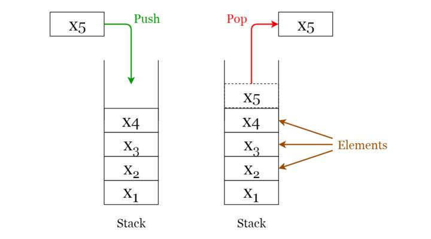

# stack-queue

# Ngăn xếp (Stacks)

Một ngăn xếp là một cấu trúc LIFO (Last In First Out - phần tử được đặt cuối cùng có thể được truy cập đầu tiên), thường được sử dụng trong nhiều ngôn ngữ lập trình. Cấu trúc này được đặt tên là "ngăn xếp" vì nó giống như một ngăn xếp thực tế - một ngăn xếp đĩa.

🔹 **Các ứng dụng của Stacks:**

- Được sử dụng để đánh giá biểu thức (ví dụ: thuật toán shunting-yard để phân tích cú pháp và đánh giá biểu thức toán học).
- Được sử dụng để triển khai các lời gọi hàm trong lập trình đệ quy.

