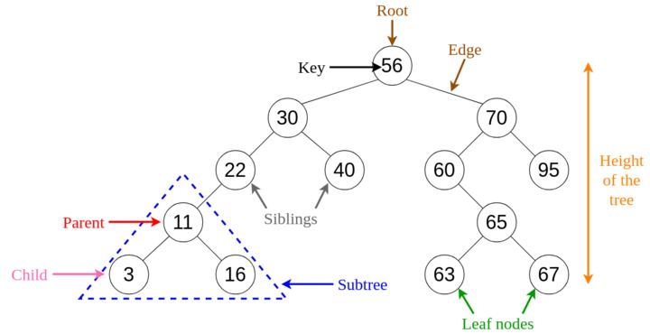

# tree

# Cây (Trees)

Một cây là một cấu trúc phân cấp trong đó dữ liệu được tổ chức theo cấp bậc và được liên kết với nhau. Cấu trúc này khác với danh sách liên kết, trong đó các mục được liên kết theo thứ tự tuyến tính.

🔹 **Các ứng dụng của cây:**

- Cây nhị phân: Được sử dụng để triển khai trình phân tích biểu thức và giải quyết biểu thức.
- Cây tìm kiếm nhị phân: được sử dụng trong nhiều ứng dụng tìm kiếm trong đó dữ liệu liên tục được thêm vào và rời khỏi.
- Cây Heap: được sử dụng bởi JVM (Java Virtual Machine) để lưu trữ đối tượng Java.
- Treap: được sử dụng trong mạng không dây.

